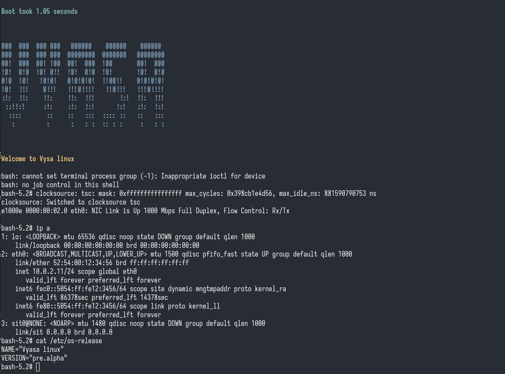
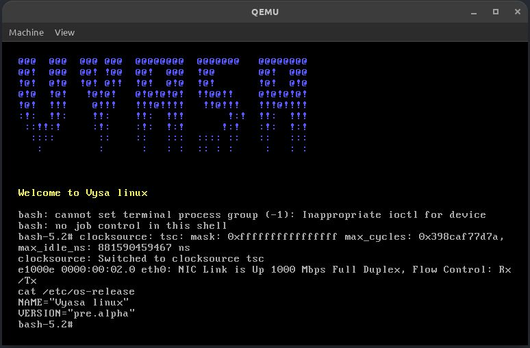

# Vyasa minimal linux

[]

[]

## Quick start

* Download packages in in source directory

❯ cd sources
❯ wget -c -i source.pkgs

* Execute from main directory

❯ nix develop # Optional for dependencies

❯ ./scripts/distrom
❯ ./scripts/vyasa

* run in qemu
`Ctrl+a` `x` to exit

❯ qemu-system-x86_64 -machine q35,accel=kvm -cpu host vyasa.qcow2
❯ qemu-system-x86_64 -machine q35,accel=kvm -cpu host vyasa.qcow2 -nographic -serial mon:stdio --no-reboot

* Backup

❯ cp vyasa.qcow2 vyasa.backup.qcow2

❯ cd rootfs
❯ doas tar --sort=name --mtime="@0" --pax-option=exthdr.name=%d/PaxHeaders/%f,delete=atime,delete=ctime,delete=btime,delete=mtime -cJpf ../vyasa.tar.xz .

## assumptions

-- NixOS
-- `20GB` minimum free disk
-- `doas` instead of `sudo`
-- `nix` package manager for dependencies

## Ignore the Notes.norg; it's more like a scratchpad

## Vyasa linux building in action

❯ ./scripts/distrom

❯ ./scripts/vyasa

